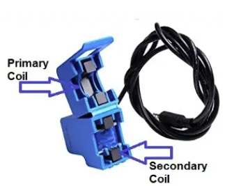
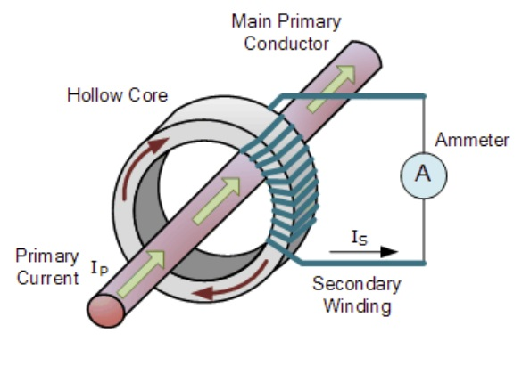
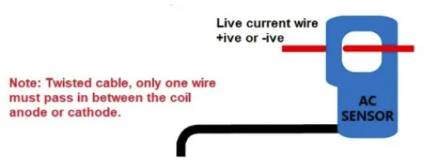

# 1. Réalisation et programmation de l'objet connecté

## 1.1 Réalisation

### 1.1.1 Présentation du capteur de courant SC-013

    Le capteur de courant SC-013 est un capteur de courant non invasif, c'est-à-dire qu'il peut être installé sur le phase du circuit à mesurer sans avoir à intervenir sur celle-ci. Aucune intervention sur l'installation électrique n'est donc nécessaire. 
    En effet, il se présente sous la forme d'un aimant coupé en 2 sur lequel est enroulé un fil électrique.
    L'aimant coupé en 2 permet d'ouvrir le SC-013 et de le refermer autour du conducteur dans lequel passe le courant à mesurer. Dans le fil secondaire autour de l'aimant circule alors un courant proportionnel au courant à mesurer circulant dans le fil conducteur primaire. 
    En ce sens, son fonctionnement est proche de celui d'un transformateur et repose sur le principe des courants induits. 

<em>Présentation du SC-013: capteur non invasif - principe de fonctionnement - montage sur le fil conducteur</em>

    Il existe différentes références du SC-013, avec ou sans résistance de charge. Pour simplifier le montage, nous avons selectionné la référence SC-013-050, équipé d'une résistance de charge intégrée et permettant de mesurer des courants primaires jusqu'à 50A (soit une puissance jusqu'à 11500W). 
    On aura donc en sortie du SC-013-050 une tension de 1V RMS (signal analogique), correspondant aux 50A dans le fil conducteur. 
    La tension RMS (signifiant <em>Root Mean Square</em>) représente une mesure de la tension crête-à-crête (ou <em>peak-to-peak</em> en anglais). La relation entre la valeur RMS et la valeur crête-à-crête d'une tension est la suivante: 

    C'est pourquoi, dans le cas du SC-013-050 avec une tension de sortie de +/- 1V RMS, la tension de crête sera de +/- 1.414V et la tension crête-à-crête sera de 2.828V. 

### 1.1.2 Présentation du convertisseur analogique-numérique ADS-1115

    Le convertisseur analogique-numérique ADS-1115 permet de convertir une mesure analogique (signal continu) en une mesure numérique. Il prend en charge le protocole de communication I2C, ce qui permet de monter jusqu'à 4 ADS-1115 sur la même ligne de communication I2C. C'est un convertisseur 16 bits, c'est-à-dire que le signal analogique mesuré sera converti en une valeur sur 2 octets. Il est équipé d'un comparateur programmable, c'est-à-dire qu'il peut convertir une difference de potentiel (une tension donc) entre 2 de ses entrées. Cela nous interesse particulièrement car nous pourrons ainsi convertir la tension (proportionnelle au courant mesuré) delivrée par le SC-013-050 en signal numérique. 
     primaire 
     induits 
     jusqu'à

### 1.1.3 La carte programmable Arduino Uno et son shield W5100

### 1.1.4 Schéma du montage

## 1.2 Récupération du timestamp

## 1.3 Transmission des données via MQTT

## 1.4 Présentation du programme définitif tournant sur l'Arduino Uno équipé du shield W5100

## 1.5 Quelques images de l'objet connecté

<em>Le capteur de courants avec ses 3 ADS1115 et le shield ethernet monté sur la carte Arduino Uno</em>

