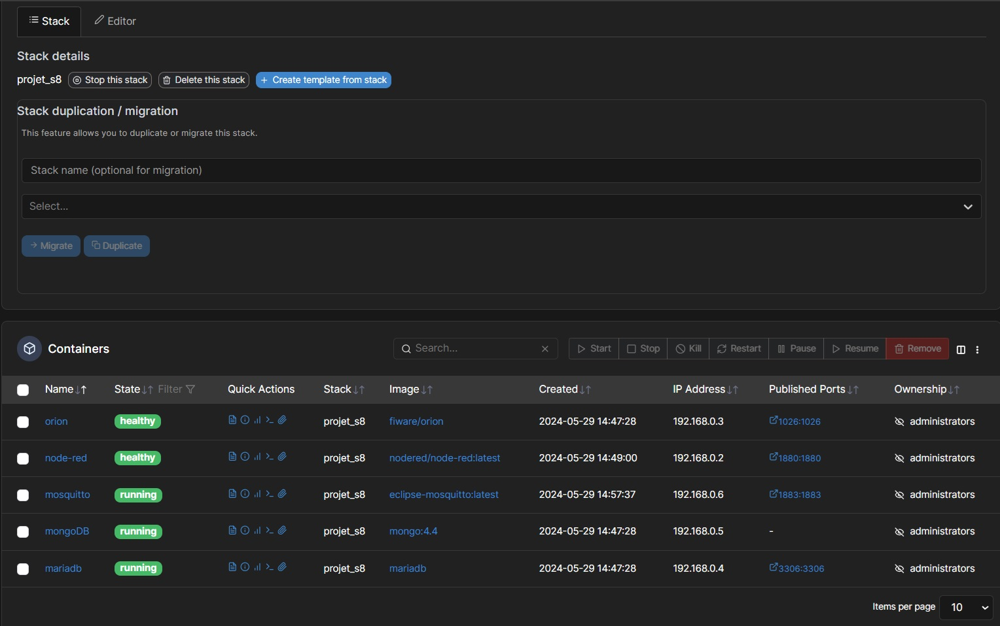

# 2. Montage d'une VM sur un serveur

Pour réaliser notre projet de compteur électrique connecté, nous avons déterminé qu'il était nécessaire d'utiliser plusieurs composants logiciels afin de mettre en place la partie relève des données.

## 2.1 Caractéristiques de la VM

&emsp;- Système d'exploitation: Ubuntu 22.04\
&emsp;- Nombre de coeurs CPU: 4\
&emsp;- Mémoire vive: 8 Go\
&emsp;- Espace disque: 40 Go

## 2.2 Installation de la machine

Dans notre cas, nous avons utilisé pour ce projet une machine virtuelle avec Ubuntu Server pré-installé.
Nous nous connectons à la machine par SSH à l'aide d'un terminal comme PuTTY ou Termius par exemple.

Le but est d'utiliser un OS qui est capable d'éxecuter une instance Docker.

On aurait tout à fait pu utiliser d'autres OS comme Windows Server, Debian, etc... Voir même d'autres systèmes plus exotiques tel que DSM, l'OS de Synology pour les NAS qui est capable d'éxecuter Docker. 

Toute plateforme de Cloud Computing en PaaS ou IaaS peut aussi être utilisé pour héberger la partie serveur/conteneur de notre projet.

## 2.3 Le déploiement de Docker sur Linux

Sur la machine, docker n'était pas installé par défaut, et nous l'avons donc installer avec ces commandes :

```# Add Docker's official GPG key:
sudo apt-get update
sudo apt-get install ca-certificates curl gnupg
sudo install -m 0755 -d /etc/apt/keyrings
curl -fsSL https://download.docker.com/linux/ubuntu/gpg | sudo gpg --dearmor -o /etc/apt/keyrings/docker.gpg
sudo chmod a+r /etc/apt/keyrings/docker.gpg

# Add the repository to Apt sources:
echo \
  "deb [arch=$(dpkg --print-architecture) signed-by=/etc/apt/keyrings/docker.gpg] https://download.docker.com/linux/ubuntu \
  $(. /etc/os-release && echo "$VERSION_CODENAME") stable" | \
  sudo tee /etc/apt/sources.list.d/docker.list > /dev/null
sudo apt-get update

```
Ces commandes permettent d'ajouter le repository officiel de Docker à APT, il ne reste plus qu'à récupérer la dernière version de Docker:

`sudo apt-get install docker-ce docker-ce-cli containerd.io docker-buildx-plugin docker-compose-plugin`

## 2.4 Déploiement de Portainer

Afin de simplifier l'utilisation de Docker, nous avons dépoyé un agent permettant de communiquer avec Docker par l'intermédiaire d'une interface Web. Voici la commande pour le déployer : 

`docker volume create portainer_data`
`docker run -d -p 8000:8000 -p 9443:9443 --name portainer --restart=always -v /var/run/docker.sock:/var/run/docker.sock -v portainer_data:/data portainer/portainer-ce:latest`


## 2.2 Caractéristiques du conteneur

### Les différentes images à intégrer:

&emsp;- Mosquitto MQTT Broker : relais entre la génération des informations (publish) et l'utilisation des informations (subscribe)
&emsp;- Orion : élément central de la couche FiWare de notre projet, gestion de nos objets et de nos abonnements
&emsp;- Mongo DB : permet le stockage des objets Orions et de leur état
&emsp;- MySQL ou MariaDB: Stockage de l'historique de données et de la configuration de Keyrock
&emsp;- Keyrock : permet d'établir la couche de sécurité d'Orion
&emsp;- NodeRED : Traitement, exploitation, présentation des données

L'idée est de déployer une stack, en important le fichier docker-compose (.yml) suivant afin de déployer tous les conteneurs nécessaires, mentionnés ci-dessus.

Nous avons 2 versions possibles pour ce fichier .yml, l'un proposant une BDDR MySQL, l'autre une BDDR MariaDB.

#### Fichier .yml de déploiement de la stack avec une BDDR MariaDB (dans cette version Keyrock n'est pas intégré):

```yml
### Création d'un environnement persistant mongoDB-Orion-NodeRed-MariaDB-MQTT Mosquitto ###

# 1. créer préalablement 4 dossiers ("mongo", "nodered", "mosquitto", "mariadb") dans le répertoire courant pour le stockage des données persistantes
# 2. Dans Portainer, après déploiement de la stack à l'aide du fichier .yml, mapper les volumes non persistants créés lors du déploiement de la stack vers les volumes créés à l'étape 1 pour chacune des images.
# 3. s'assurer que les images sont sur un même réseau interne et ont des adresses IP internes (sur port 1026 pour Orion, sur port 1880 pour Node-Red, sur port 1883 pour Mosquitto, sur port 3306 pour MariaDB)
# 4. configurer Mosquitto (fichier config et passwd, voir https://itbacon.com/2023/08/01/installing-mosquitto-mqtt-in-portainer/)
# 5. configurer MariaDB en créant la BDD et les tables necessaires (1 temporaire pour moyenne des puissances sur 1 minute, 1 pour enregistrement toutes les minutes)
version: "3.9"
services:
  mongo:
    container_name: "mongoDB"
    image: mongo:4.4
    command: --nojournal
    networks:
      - internal
    volumes:
      - ./mongo:/data/db
  orion:
    container_name: "orion"
    image: fiware/orion
    ports:
      - "1026:1026"
    networks:
      - internal
    command: -dbhost mongo
  nodered:
    container_name: "node-red"
    image: nodered/node-red
    ports:
      - "1880:1880"
    networks:
      - internal
    volumes:
      - ./nodered:/data
  mosquitto:
    container_name: "mosquitto"
    restart: "unless-stopped"
    image: "eclipse-mosquitto"
    networks:
      - internal
    ports:
      - "1883:1883/tcp"
    volumes:
      - ./mosquitto:/mosquitto/config
      - ./mosquitto:/mosquitto/data
      - ./mosquitto:/mosquitto/log
  mariadb:
    container_name: "mariadb"
    image: mariadb
    restart: always
    networks:
      - internal
    ports:
      - "3306:3306/tcp"
    volumes:
      - ./mariadb:/data
    environment:
      MARIADB_ROOT_PASSWORD: to_set #à changer

# lignes pas forcément utiles, chaque image ayant sa commande "networks: - internal" dans sa commande de déploiement (à tester sans)
networks:
  internal:
```

#### Fichier .yml de déploiement de la stack avec une BDDR MySQL:

```yml
### Création d'un environnement persistant mongoDB-Orion-NodeRed-Keyrock-MQTT Mosquitto-MySQL ###
version: '3.8'

services:
  orion:
    image: fiware/orion
    hostname: orion
    container_name: fiware-orion
    depends_on:
      - mongo-db
    ports:
      - "1026:1026"
    environment:
      - ORION_PORT=1026
      - MONGO_HOST=mongo-db
      - MONGO_PORT=27017
      - CONTEXT_BROKER_LOGLEVEL=DEBUG
    command: -dbhost mongo-db -logLevel DEBUG
    networks:
      - internal
    volumes:
      - ./mongo:/data/db

  mongo-db:
    image: mongo:4.2
    hostname: mongo-db
    container_name: fiware-mongo-db
    ports:
      - "27017:27017"
    networks:
      - internal
    volumes:
      - mongo-db-data:/data/db

  keyrock:
    image: fiware/idm
    hostname: keyrock
    container_name: fiware-keyrock
    depends_on:
      - mysql-db
    ports:
      - "3000:3000"
    networks:
      - internal
    environment:
      - IDM_DB_HOST=mysql-db
      - IDM_DB_PASS=idm #à changer
      - IDM_DB_USER=root
      - IDM_DB_NAME=idm 
      - IDM_ADMIN_USER=admin
      - IDM_ADMIN_EMAIL=admin@test.com #à changer
      - IDM_ADMIN_PASS=1234 #à changer
      - IDM_HOST=http://localhost:3000

  mysql-db:
    image: mysql:5.7
    hostname: mysql-db
    container_name: fiware-mysql-db
    ports:
      - "3306:3306"
    networks:
      - internal
    environment:
      - MYSQL_ROOT_PASSWORD=idm #à changer
      - MYSQL_DATABASE=idm #à changer
    volumes:
      - mysql-db-data:/var/lib/mysql

  mosquitto:
    image: eclipse-mosquitto
    hostname: mosquitto
    container_name: fiware-mosquitto
    networks:
      - internal
    ports:
      - "1883:1883/tcp"
    volumes:
      - mosquitto:/mosquitto/config
      - mosquitto:/mosquitto/data
      - mosquitto:/mosquitto/log

  node-red:
    image: nodered/node-red
    hostname: node-red
    container_name: fiware-node-red
    networks:
      - internal
    ports:
      - "1880:1880"
    volumes:
      - node-red-data:/data
    environment:
      - NODE_RED_FLOW_PATH=/data/flows.json

# lignes pas forcément utiles, chaque image ayant sa commande de mappage de volumes pour la persistence des données (à tester sans)
volumes:
  mongo-db-data:
  mysql-db-data:
  mosquitto:
  node-red-data:

```

#### Les différentes étapes du déploiement:

&emsp;- Manipulations antérieures au déploiement de la stack:\
Créer préalablement 4 dossiers ("mongo", "nodered", "mosquitto", "mariadb" ou "MySQL") dans le répertoire courant pour le stockage des données persistantes

&emsp;- Manipulations postérieures au déploiement de la stack:\
&emsp;&emsp;- volumes à mapper pour la persistance des données:\
Dans Portainer, après déploiement de la stack à l'aide du fichier .yml, mapper les volumes non persistants créés lors du déploiement de la stack vers les volumes créés à l'étape 1 pour chacune des images.
&emsp;&emsp;- réseau identique pour chacune des images:\
S'assurer que les images sont sur un même réseau interne et ont des adresses IP internes (sur port 1026 pour Orion, sur port 1880 pour Node-Red, sur port 1883 pour Mosquitto, sur port 3306 pour MariaDB/MySQL)
&emsp;&emsp;- configuration serveur Mosquitto:
configurer Mosquitto (fichier config et passwd, voir https://itbacon.com/2023/08/01/installing-mosquitto-mqtt-in-portainer/)
&emsp;&emsp;- configuration de Keyrock (authentification dans Orion):
Accéder à l'interface Web en se connectant à l'adresse de la machine avec le port 3000 : 
a. connecter avec les identifiants par défaut de Keyrock
b. créer une nouvelle application, Keyrock donnera par la suite deux informations : un *clientID* et un *clientSecret*
c. sur l'interface de Portainer, modifier le conteneur pour ajouter les variables d'environnement suivantes :

`IDM_SSL_ENABLED=false`
`CLIENT_ID=your_client_id`
`CLIENT_SECRET=your_client_secret`
`USER_AUTH=true`

d. Re-déployer le conteneur.

## 2.3 Résultat de la stack complète montée dans Portainer (exemple avec BDDR MySQL)


<p style="text-align: center;"><em>Le résultat de la stack avec les différentes images déployées dans Portainer</em></p>
