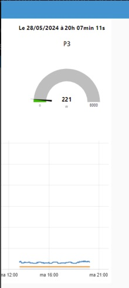

## 3. Programmation des flux et du dashboard Node-Red
Une fois que l'objet récupérait bien les données électriques, l'objectif était d'utiliser Fiware avec le context-broker Orion pour gérer facilement ces données. Pour ce faire nous avons décidé d'utiliser Node-Red afin de relier l'objet de calcul électrique à plusieurs services.

## 3.1 Récupération des flux MQTT
Pour récupérer les données envoyées par l'objet connecté, nous avons utilisé le protocole MQTT (Message Queuing Telemetry Transport). MQTT est un protocole léger de messagerie publish/subscribe qui convient parfaitement pour les appareils à faible bande passante. Dans Node-Red, nous avons ajouté un nœud mqtt in pour nous abonner aux messages envoyés par l'objet sur un sujet spécifique. Voici les étapes suivies :
- Ajouter un nœud mqtt in dans l'interface Node-Red.
- Configurer ce nœud avec l'adresse du broker MQTT et le sujet sur lequel les données sont publiées.
- Relier le nœud mqtt in à un nœud de débogage pour vérifier que les données sont correctement reçues.

## 3.2 Enregistrement de l'objet Fiware Orion et création d'abonnements
Pour gérer les données avec Fiware Orion, nous avons d'abord enregistré les mesures électrique de notre objet connecté comme une entité dans le context-broker Orion. Les étapes pour l'enregistrement sont les suivantes :
- Utiliser l'API REST de Fiware Orion pour créer une nouvelle entité représentant une mesure électrique (timestamp, puissance1, puissance2, puissance3 dans notre cas).
- Définir les attributs de l'entité correspondant aux différents objets de mesure.

Ensuite une fois que les entités sont créés, nous avons configurer des abonnements dans Orion. Un pour que chaque mise à jour des données de l'objet soit envoyée à des services spécifiques. Et d'autres contenant des conditions afin d'envoyer une notification chaque fois que cette condition est respectée. Lorsqu'un objet dépasse une certaine puissance par exemple une notification est envoyée. Cela permet d'indiquer par la suite que l'appareil dont la puissance est calulée est en fonctionnement.

## 3.3 Enregistrement historisé dans MariaDB
Pour garder un historique des données, nous avons choisi d'utiliser une base de données MariaDB. Node-Red facilite cette intégration grâce à des nœuds spécifiques pour les bases de données. Voici comment nous avons procédé :
- Ajouter un nœud mysql dans Node-Red.
- Configurer ce nœud avec les paramètres de connexion à notre base de données MariaDB (hôte, utilisateur, mot de passe, base de données).
- Relier les données reçues par MQTT à ce nœud mysql avec un nœud fonction pour formater les données en requêtes SQL (INSERT INTO).

Pour avoir un affichage plus rapide nous avons décidé de ne pas afficher tous les points (un toutes les 3 secondes). Notre choix a été d'afficher une valeur par minute. Pour effectuer cela nous avons dû faire une moyenne des valeurs pour chaque minute. Nous avons donc créer une table qui contiendra une ligne par minute et une table temporaire, qui contient une ligne toutes les 3 secondes.

Pour rappel nous avons trois capteurs sur notre objet connecté. Voici un exemple de la composition d'une table (table puissance) :
- timestamp
- puissance1
- puissance2
- puissance3

Nous avons donc écrit un script en SQL pour faire une moyenne des données sur un certain temps depuis la table temporaire, ces moyennes de données sont ensuites insérer dans la table principale.
Ce script vide également la table temporaire toutes les 10 minutes.
Ensuite il a fallu créer un EVENT qui exécute le script toutes les minutes.

Voici le script qui permet d'automatiser ces actions : 
```
-- Fonction permettant d'envoyer la moyenne des données sur une minute dans la table principale
-- Effaçage des données de plus de 10 minutes dans la table temporaire
CREATE PROCEDURE InsertAverage()
BEGIN
    DECLARE avg_puissance1 FLOAT;
    DECLARE avg_puissance2 FLOAT;
    DECLARE avg_puissance3 FLOAT;
    DECLARE now_time DATETIME;

    SET now_time = NOW();

    SELECT AVG(puissance1), AVG(puissance2), AVG(puissance3)
    INTO avg_puissance1, avg_puissance2, avg_puissance3
    FROM puissance_temporaire
    WHERE timestamp >= (now_time - INTERVAL 1 MINUTE);

    INSERT INTO puissance (average_puissance1, average_puissance2, average_puissance3, timestamp)
    VALUES (avg_puissance1, avg_puissance2, avg_puissance3, now_time);

    -- Optionnel : Supprime les entrées de plus de 10 minutes
    DELETE FROM puissance_temporaire
    WHERE timestamp < (now_time - INTERVAL 10 MINUTE);
END

-- Créeation d'un evenement qui éxécute la fonction toutes les minutes
CREATE EVENT IF NOT EXISTS CalculateAndStoreAverage
ON SCHEDULE EVERY 1 MINUTE
DO CALL InsertAverage();

```
## 3.4 Dashboard
Pour visualiser les données en temps réel, nous avons utilisé le tableau de bord de Node-Red. Le tableau de bord permet de créer des graphiques et des indicateurs visuels facilement. Les étapes pour configurer le tableau de bord sont :
- Ajouter des nœuds ui dans Node-Red pour les différents éléments de visualisation (graphique linéaire, jauge, texte).
- Configurer ces nœuds pour afficher les données pertinentes (puissance instantanée, consommation cumulée, date et heure d'affichage, etc.).
- Relier les nœuds de visualisation aux flux de données MQTT ou à un abonnement Orion pour afficher les informations en temps réel.

## 3.5 Quelques images des flux et du dashboard


<p style="text-align: center;"><em>Rendu des données dans le dashboard de Node-Red</em></p>
