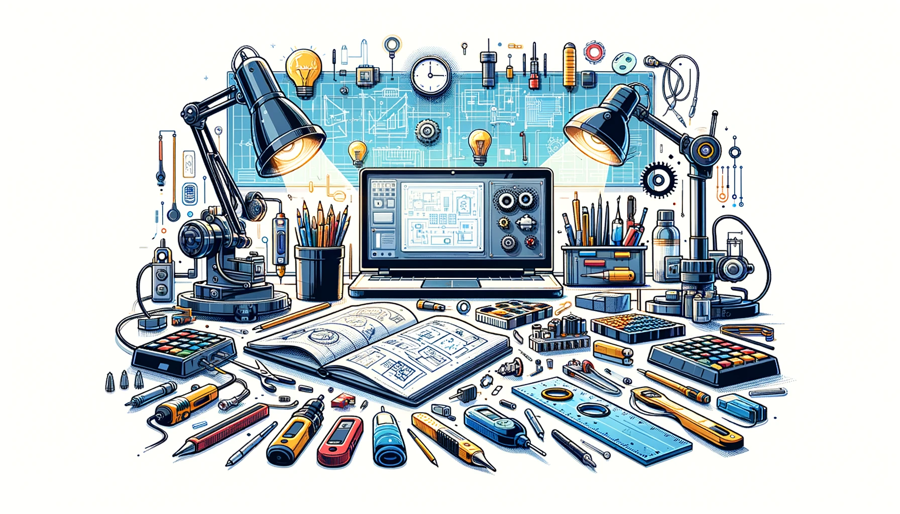
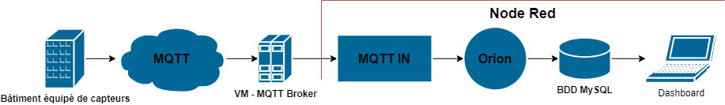

<h1 style="text-align: center;"><strong> Documentation de notre projet:   "IoT electricity power counter"</strong></h1> 
 
Bienvenue dans la documentation du projet "IoT electricity power counter". Ce site a pour but de fournir toutes les informations nécessaires pour comprendre, utiliser et reproduire efficacement notre projet.

## À propos du projet

L'objectif de ce projet est la réalisation d'un capteur de courant connecté servant au calcul de la puissance consommée sur une ligne électrique.\
Ce projet a été réalisé en 3 étapes:\
&emsp;1. Réalisation et programmation de l'objet connecté.\
&emsp;2. Montage d'une VM sur un serveur executant un conteneur, et déploiement des images nécessaires dans le conteneur.\
&emsp;3. Développement des flux et des dashboards Node-Red.

## Poster

<em>Parcours des données du capteur jusqu'au dashboard</em>

## Vidéo

Ici vous publierez la vidéo de votre projet. 
- Moins de 1min30
- Présentation du projet 
- Des explication du fonctionnement du projet
- Des vues du projet / Prototype / Application etc... 
- Des plans du fonctionnement (même basique ou des éléments séparés)
- Une conclusion
Si en stockage local : >50mo

<video src="images/intro_amiens.mp4" controls title="Title"  style="width: 100%;"></video>

---
