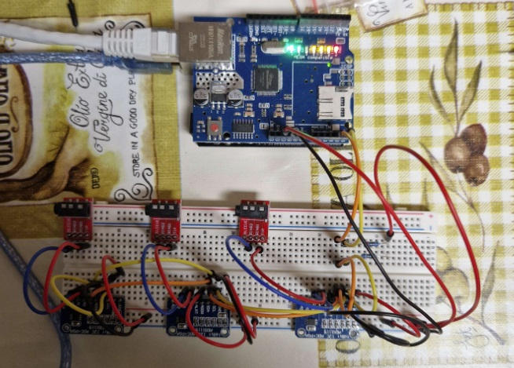
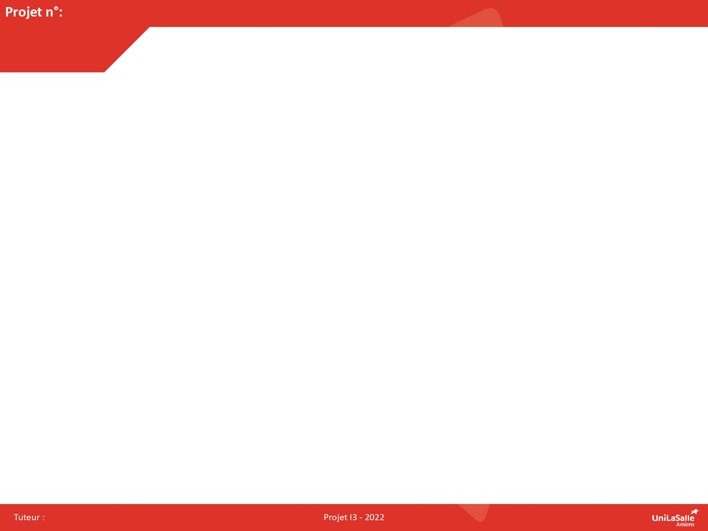

<h1 style="text-align: center;"><strong> Documentation de notre projet:   "IoT electricity power counter"</strong></h1> 
 
Bienvenue dans la documentation du projet "IoT electricity power counter". Ce site a pour but de fournir toutes les informations nécessaires pour comprendre, utiliser et reproduire efficacement notre projet.

## À propos du projet

L'objectif de ce projet est la réalisation d'un capteur de courant connecté servant au calcul de la puissance consommée sur une ligne électrique.\
Ce projet a été réalisée en 3 étapes:\
&emsp;1. Réalisation et programmation de l'object connecté lui-même, basé sur:\
&emsp;&emsp;- 3 capteurs de courants non invasifs [SC-013-050](https://www.amazon.fr/dp/B07MY3NNFR?psc=1&ref=ppx_yo2ov_dt_b_product_details)\
&emsp;&emsp;- 3 modules de conversion analogique numérique [ADS1115](https://www.amazon.fr/dp/B07QHWLTTS?ref=ppx_yo2ov_dt_b_product_details&th=1)\
&emsp;&emsp;- 1 [carte Arduino Uno](https://www.amazon.fr/dp/B01JD2Z5XW?psc=1&ref=ppx_yo2ov_dt_b_product_details)\
&emsp;&emsp;- 1 [shield ethernet W5100](https://www.amazon.fr/dp/B07XYYJXM3?psc=1&ref=ppx_yo2ov_dt_b_product_details)\
&emsp;&emsp;- des [composants de raccordement](https://www.amazon.fr/dp/B0B5D3YBLZ?psc=1&ref=ppx_yo2ov_dt_b_product_details) pour les jacks des SC-013\
&emsp;&emsp;- quelques [fils suplémentaires](https://www.amazon.fr/dp/B07KWBHL11?psc=1&ref=ppx_yo2ov_dt_b_product_details) de bonne qualité, ce n'est pas un mauvais investissement...\
&emsp;2. Montage d'une VM sur un serveur pour:\
&emsp;&emsp;- héberger Portainer (gestionnaire de conteneurs type Docker)\
&emsp;&emsp;- monter dans une même stack:\
&emsp;&emsp;&emsp;- une image Orion et MongoDB pour la gestion des objets Fiware\
&emsp;&emsp;&emsp;- une image Node-Red pour la gestion des flux et l'affichage des données sur un dashboard\
&emsp;&emsp;&emsp;- une image MariaDB pour le stockage en historique des objets Fiware\
&emsp;&emsp;&emsp;- une image d'un serveur MQTT tel que Mosquitto pour la récupération des données transmises par l'objet connecté\
&emsp;3. Développement des flux Node-Red permettant:\
&emsp;&emsp;- la récupération des données de l'object connecté\
&emsp;&emsp;- la création et l'enregistrement dans MongoDB des objets Fiware, ainsi que la création d'abonnements pour remonter d'éventuelles alertes sur le dashboard\
&emsp;&emsp;- l'enregistrement historisé dans MariaDB des données transmises par l'objet connecté\
&emsp;&emsp;- l'affichage des données historisées et instantanées dans un graphique sur le dashboard Node-Red

## Illustration par quelques images

&emsp;1. Images de l'objet connecté basé sur des capteurs de courant non invasifs

<em>Le capteur de courants avec ses 3 ADS1115</em>

&emsp;2. Image du résultat de la stack complète montée dans Portainer

<em>Le résultat de la stack avec les différentes images déployées dans Portainer</em>

&emsp;3. Images du flux Node-Red et du Dashboard associé

<em>Rendu des données dans le dashboard de Node-Red</em>

## Poster

Ici vous publierez le poster de votre projet.

## Vidéo

Ici vous publierez la vidéo de votre projet. 
- Moins de 1min30
- Présentation du projet 
- Des explication du fonctionnement du projet
- Des vues du projet / Prototype / Application etc... 
- Des plans du fonctionnement (même basique ou des éléments séparés)
- Une conclusion
Si en stockage local : >50mo

<video src="images/intro_amiens.mp4" controls title="Title"  style="width: 100%;"></video>

---